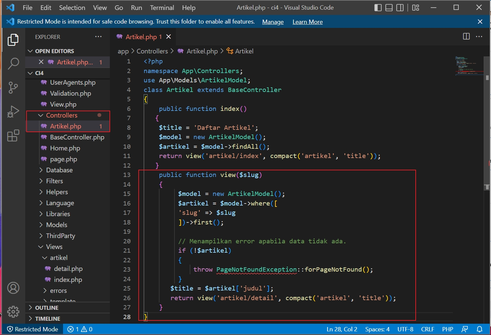

# Pemograman Web2 Pertemuan 10

## Profil
| #               | Biodata                      |
| --------------- | ---------------------------- |
| **Nama**        | M. AKMAL AL ABDILAH          |
| **NIM**         | 312110034                    |
| **Kelas**       | TI.21.A.1                    |
| **Mata Kuliah** | Pemrograman Web 2            |

<p align="center">
 
</p>
<p align="center">
<a href="https://github.com/akmalabdilah"></a>
<p align="center">


<hr>

**Praktikum 8 : Framework Lanjutan (CRUD)**

**Pemrograman Web: Framework Lanjutan (CRUD)**

<hr>

**Instruksi Praktikum**
1. Persiapkan text editor misalnya **VSCode**.
2. Buka kembali folder dengan nama **lab7_php_ci** pada docroot webserver **(htdocs)**
3. Ikuti langkah-langkah praktikum yang akan dijelaskan berikutnya.<br>

**Langkah-langkah Praktikum
Persiapan.**
Untuk memulai membuat aplikasi CRUD sederhana, yang perlu disiapkan adalah 
database server menggunakan MySQL. Pastikan MySQL Server sudah dapat dijalankan 
melalui XAMPP.

**Membuat Database: Studi Kasus Data Artikel**


**`Membuat Database`**

```
CREATE DATABASE lab_ci4;
```


Gambar 1.CREATE DATABASE

**`Membuat Tabel`**
```
CREATE TABLE artikel (
id INT(11) auto_increment,
judul VARCHAR(200) NOT NULL,
isi TEXT,
gambar VARCHAR(200),
status TINYINT(1) DEFAULT 0,
slug VARCHAR(200),
PRIMARY KEY(id)
);
```


Gambar 2.Membuat Tabel


**`Konfigurasi koneksi database`**

Selanjutnya membuat konfigurasi untuk menghubungkan dengan database server.
Konfigurasi dapat dilakukan dengan du acara, yaitu pada file **app/config/database.php**
atau menggunakan file **.env**. Pada praktikum ini kita gunakan konfigurasi pada file .env.


Gambar 3.Konfigurasi Database

**`Membuat Model`**

Selanjutnya adalah membuat Model untuk memproses data Artikel. Buat file baru pada
direktori **app/Models** dengan nama **ArtikelModel.php**
```
<?php
namespace App\Models;
use CodeIgniter\Model;
class ArtikelModel extends Model
{
protected $table = 'artikel';
protected $primaryKey = 'id';
protected $useAutoIncrement = true;
protected $allowedFields = ['judul', 'isi', 'status', 'slug', 'gambar'];
}
```


Gambar 4.ArtikelModel.php

**`Membuat Controller`**

Buat Controller baru dengan nama ***Artikel.php*** pada direktori ***app/Controllers***.
```
<?php
namespace App\Controllers;
use App\Models\ArtikelModel;
class Artikel extends BaseController
{
   public function index()
  {
  $title = 'Daftar Artikel';
  $model = new ArtikelModel();
  $artikel = $model->findAll();
  return view('artikel/index', compact('artikel', 'title'));
  }
}
```


Gambar 5.Artikel.php

**`Membuat View`**

Buat direktori baru dengan nama ***artikel*** pada direktori ***app/views***, kemudian buat file
baru dengan nama ***index.php***.
```
<?= $this->include('template/header'); ?>

<?php if($artikel): foreach($artikel as $row): ?>
    <article class="entry">
    <h2><a href="<?= base_url('/artikel/' . $row['slug']);?>"><?= $row['judul']; ?></a>
</h2>
    " alt="<?= $row['judul']; ?>">
    <p><?= substr($row['isi'], 0, 200); ?></p>
</article>
<hr class="divider" />
<?php  endforeach; else: ?>
<article class="entry">
    <h2>Belum ada data.</h2>
</article>
<?php endif; ?>
<?= $this->include('template/footer'); ?>
```


Gambar 6.index.php

Selanjutnya buka browser kembali, dengan mengakses url http://localhost:8080/artikel


Gambar 7.Tampilan Web.Artikel

Belum ada data yang diampilkan. Kemudian coba tambahkan beberapa data pada
***Database*** agar dapat ditampilkan datanya.
```
INSERT INTO artikel (judul, isi, slug) VALUE
('Artikel pertama', 'Lorem Ipsum adalah contoh teks atau dummy dalam industri
percetakan dan penataan huruf atau typesetting. Lorem Ipsum telah menjadi
standar contoh teks sejak tahun 1500an, saat seorang tukang cetak yang tidak
dikenal mengambil sebuah kumpulan teks dan mengacaknya untuk menjadi sebuah
buku contoh huruf.', 'artikel-pertama'),
('Artikel kedua', 'Tidak seperti anggapan banyak orang, Lorem Ipsum bukanlah
teks-teks yang diacak. Ia berakar dari sebuah naskah sastra latin klasik dari
era 45 sebelum masehi, hingga bisa dipastikan usianya telah mencapai lebih
dari 2000 tahun.', 'artikel-kedua');
```


Gambar 8.add database.Artikel

Refresh kembali browser, sehingga akan ditampilkan hasilnya.


Gambar 9.Tampilan Artikel

**`Membuat Tampilan Detail Artikel`**

Tampilan pada saat judul berita di klik maka akan diarahkan ke halaman yang berbeda.
Tambahkan fungsi baru pada ***Controller Artikel*** dengan nama ***view()***.
```
public function view($slug)
    {
         $model = new ArtikelModel();
         $artikel = $model->where([
         'slug' => $slug
         ])->first();
         
         // Menampilkan error apabila data tidak ada.
         if (!$artikel)
         {
             throw PageNotFoundException::forPageNotFound();
         }
       $title = $artikel['judul'];
       return view('artikel/detail', compact('artikel', 'title'));
    }
    public function admin_index()
   {
    $title = 'Daftar Artikel';
    $model = new ArtikelModel();
    $artikel = $model->findAll();
    return view('artikel/admin_index', compact('artikel', 'title'));
   }
   ```


Gambar 10.Controller_Artikel

**`Membuat View Detail`**

Buat view baru untuk halaman detail dengan nama ***app/views/artikel/detail.php***.
```
<?= $this->include('template/header'); ?>
<article class="entry">
<h2><?= $artikel['judul']; ?></h2>
" alt="<?=
$artikel['judul']; ?>">
<p><?= $artikel['isi']; ?></p>
</article>
<?= $this->include('template/footer'); ?>
```


Gambar 11.View detail.php

**`Membuat Routing untuk artikel detail`**

Buka Kembali file ***app/config/Routes.php***, kemudian tambahkan routing untuk artikel
detail.
```
$routes->get('/artikel/(:any)', 'Artikel::view/$1');
```


Gambar 12.routes.Artikel

Refresh kembali browser, sehingga akan ditampilkan hasilnya.


Gambar 13.Detail Artikel

**`Membuat Menu Admin`**

Menu admin adalah untuk proses CRUD data artikel. Buat method baru pada
***Controller Artikel*** dengan nama ***admin_index()***.
```
public function admin_index()
{
$title = 'Daftar Artikel';
$model = new ArtikelModel();
$artikel = $model->findAll();
return view('artikel/admin_index', compact('artikel', 'title'));
}
```


Gambar 14.Controller_Artikel_admin_index

Selanjutnya buat view untuk tampilan admin dengan nama ***admin_index.php***
```
<?= $this->include('template/admin_header'); ?>

<table class="table">
    <thead>
       <tr>
          <th>ID</th>
          <th>Judul</th>
          <th>Status</th>
          <th>AKsi</th>
     </tr>
    </thead>
    <tbody>
    <?php if($artikel): foreach($artikel as $row): ?>
    <tr>
       <td><?= $row['id']; ?></td>
       <td>
          <b><?= $row['judul']; ?></b>
          <p><small><?= substr($row['isi'], 0, 50); ?></small></p>
       </td>
       <td><?= $row['status']; ?></td>
       <td>
          <a class="btn" href="<?= base_url('/admin/artikel/edit/' .
$row['id']);?>">Ubah</a>
            <a class="btn btn-danger" onclick="return confirm('Yakin menghapus data?');" href="<?= base_url('/admin/artikel/delete/' .
$row['id']);?>">Hapus</a>
    </td>
    </tr>
    <?php endforeach; else: ?>
    <tr>
       <td colspan="4">Belum ada data.</td>
     </tr>
     <?php endif; ?>
     </tbody>
     <tfoot>
        <tr>
           <th>ID</th>
           <th>Judul</th>
           <th>Status</th>
           <th>AKsi</th>
        </tr>
     </tfoot>
 </table>
 
<?= $this->include('template/admin_footer'); ?>
```


Gambar 15.admin_index.php

Selanjutnya kita buat template halaman admin **di app/Views/template** dengan nama :<br>
`admin_header.php`

`admin_footer.php`

lalu buat css baru **di folder ci4/public** dengan nama :

`adminstyle.css`

Tambahkan routing untuk menu admin seperti berikut:
```
$routes->group('admin', function($routes) {
$routes->get('artikel', 'Artikel::admin_index');
$routes->add('artikel/add', 'Artikel::add');
$routes->add('artikel/edit/(:any)', 'Artikel::edit/$1');
$routes->get('artikel/delete/(:any)', 'Artikel::delete/$1');
});
```


Gambar 16.add routing.php

Akses menu admin dengan url http://localhost:8080/admin/artikel


Gambar 17.Admin index

**`Menambah Data Artikel`**

Tambahkan fungsi/method baru pada **Controller Artikel** dengan nama **add()**.
```
public function add()
{
// validasi data.
$validation = \Config\Services::validation();
$validation->setRules(['judul' => 'required']);
$isDataValid = $validation->withRequest($this->request)->run();
if ($isDataValid)
{
$artikel = new ArtikelModel();
$artikel->insert([
'judul' => $this->request->getPost('judul'),
'isi' => $this->request->getPost('isi'),
'slug' => url_title($this->request->getPost('judul')),
]);
return redirect('admin/artikel');
}
$title = "Tambah Artikel";
return view('artikel/form_add', compact('title'));
}
```


Gambar 18.Controller_add

Kemudian buat view untuk form tambah dengan nama **form_add.php**
```
<?= $this->include('template/admin_header'); ?>
<h2><?= $title; ?></h2>
<form action="" method="post">
<p>
<input type="text" name="judul">
</p>
<p>
<textarea name="isi" cols="50" rows="10"></textarea>
</p>
<p><input type="submit" value="Kirim" class="btn btn-large"></p>
</form>
<?= $this->include('template/admin_footer'); ?>
```


Gambar 19.form_add.php

Akses menu admin dengan url http://localhost:8080/admin/artikel/add


Gambar 20.Tambah Artikel

**`Mengubah Data`**

Tambahkan fungsi/method baru pada ***Controller Artikel*** dengan nama ***edit()***.
```
public function edit($id)
{
$artikel = new ArtikelModel();
// validasi data.
$validation = \Config\Services::validation();
$validation->setRules(['judul' => 'required']);
$isDataValid = $validation->withRequest($this->request)->run();
if ($isDataValid)
{
$artikel->update($id, [
'judul' => $this->request->getPost('judul'),
'isi' => $this->request->getPost('isi'),
]);
return redirect('admin/artikel');
}
// ambil data lama
$data = $artikel->where('id', $id)->first();
$title = "Edit Artikel";
return view('artikel/form_edit', compact('title', 'data'));
}
```


Gambar 21.Controller_Function edit

Kemudian buat view untuk form tambah dengan nama ***form_edit.php***
```
<?= $this->include('template/admin_header'); ?>
<h2><?= $title; ?></h2>
<form action="" method="post">
<p>
<input type="text" name="judul" value="<?= $data['judul'];?>" >
</p>
<p>
<textarea name="isi" cols="50" rows="10"><?=
$data['isi'];?></textarea>
</p>
<p><input type="submit" value="Kirim" class="btn btn-large"></p>
</form>
<?= $this->include('template/admin_footer'); ?>
```


Gambar 22.form_edit.php

Akses menu admin dengan url http://localhost:8080/admin/artikel/edit/1


Gambar 23.Ubah Artikel

**`Menghapus Data`**

Tambahkan fungsi/method baru pada ***Controller Artikel ***dengan nama ***delete()***.
```
public function delete($id)
{
$artikel = new ArtikelModel();
$artikel->delete($id);
return redirect('admin/artikel');
}
```


Gambar 24.Controller_delete

<hr>

## **`Pertanyaan dan Tugas`**

<hr>

Selesaikan programnya sesuai Langkah-langkah yang ada. Anda boleh melakukan
improvisasi.

>**Jawab**:

Saya Coba Dengan menambahakan Artikel ketiga,
Akses menu admin dengan url http://localhost:8080/admin/artikel/add

**`Tambah Artikel`**


Gambar 25.Tambah_artikel ketiga


Gambar 26.Tampilan_tambah_artikel ketiga


Gambar 27.Tampilan_Portal Berita_artikel ketiga


**`Edit Artikel`**

Akses menu admin dengan url http://localhost:8080/admin/artikel/edit/1


Gambar 28.Edit_artikel


**`Hapus Artikel`**

Akses menu admin dengan url http://localhost:8080/admin/artikel/


Gambar 29.Hapus_artikel


Gambar 30.Tampilan_Hapus_artikel


- Selesai


<div>
<h2 align="center">Thanks For Reading!!!</h2>
<div align="center">

